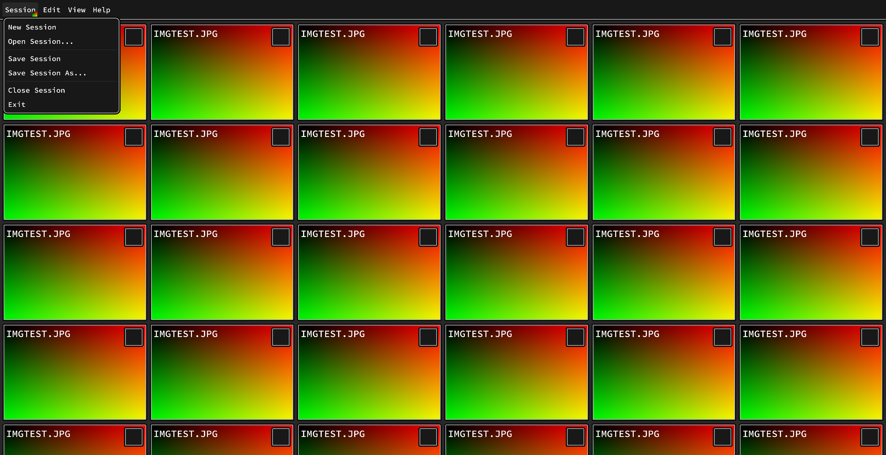

# Software Renderer



This project started out as a software rendering based 2D game engine. However, it has slowly evolved to become a literal "software renderer" to render UI for desktop applications. You can access the old software rendering game engine under [pre-sdl-gpu-archive](https://github.com/satiniize/software-renderer/tree/pre-sdl-gpu-archive) branch.

- Uses [SDL](https://www.libsdl.org/), [SDL_image](https://github.com/libsdl-org/SDL_image), and [SDL_ttf](https://github.com/libsdl-org/SDL_ttf) for rendering, using the new SDL_GPU API.
- Uses [clay](https://github.com/nicbarker/clay) by Nic Barker for UI layout and styling.
- Entity Component System (ECS) architecture for miscellaneous objects.

This project uses Git submodules. To clone the repository and initialize the SDL submodule, run:

```bash
git clone --recursive https://github.com/satiniize/software-renderer.git
```

If you already cloned the repository without `--recursive`, initialize the submodule with:

```bash
git submodule update --init --recursive
```

### Building

To build the project, run:

```bash
./build.sh [debug|release]
```

## License

This project is licensed under the GPLv3 license. See the [LICENSE](LICENSE) file for details.
